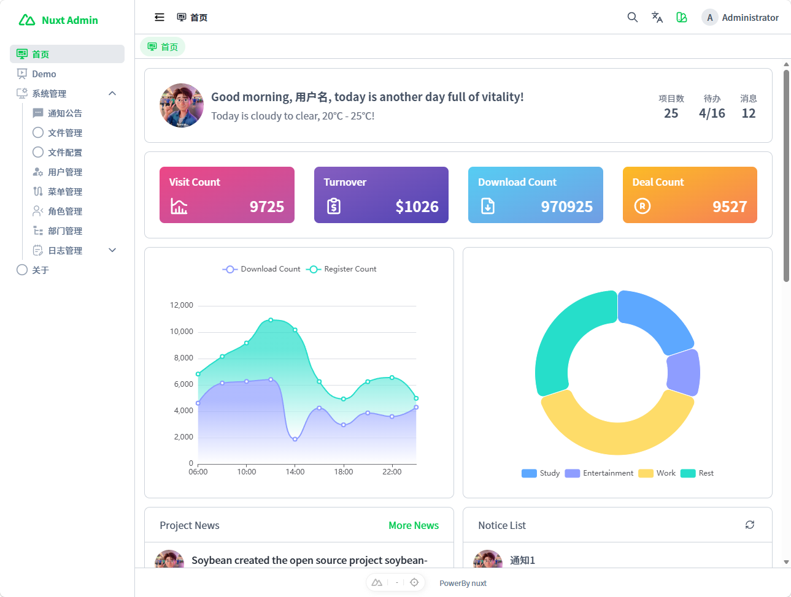
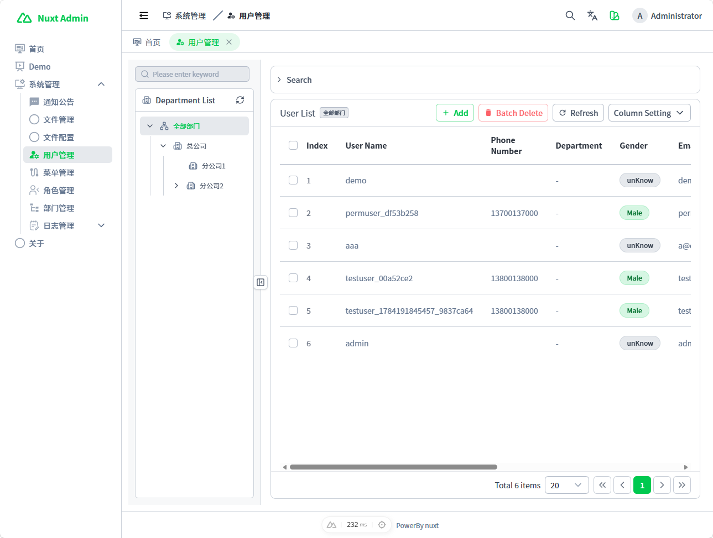
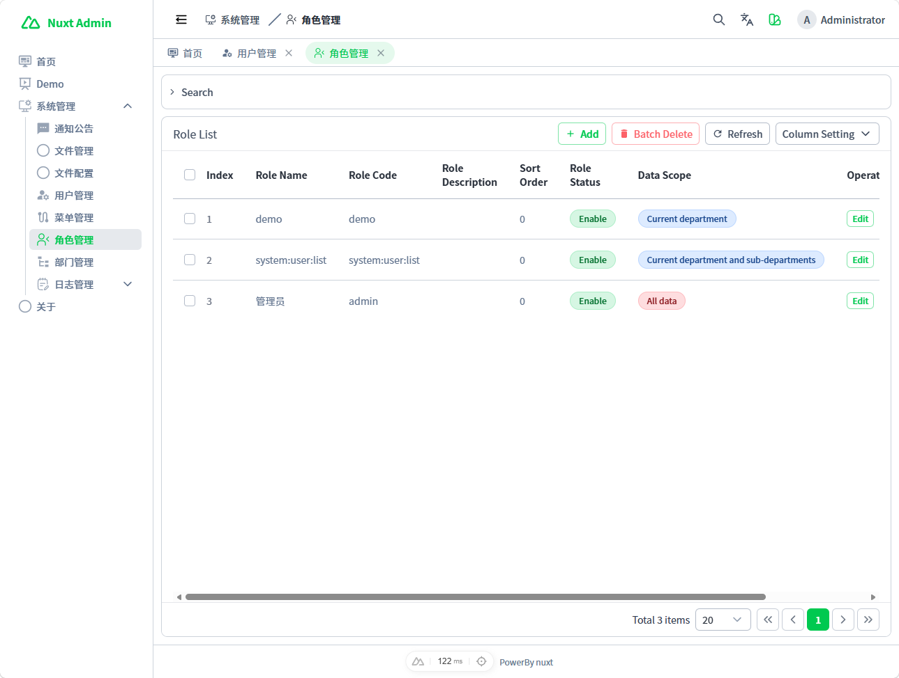

# NuxtAdmin

A full-stack Nuxt 4 admin system built with Nuxt UI, tRPC, Drizzle ORM, and MySQL.

NuxtAdmin is designed as a practical foundation for internal tools, business management platforms, and backend administration systems. It puts the admin interface, authentication, RBAC permissions, system modules, typed APIs, and database access in one Nuxt application.

> Frontend inspiration: [SoybeanJS](https://soybeanjs.cn/)
>
> Recommended Node.js version: `22.20.2`

## Status

The project is still being polished. The administrator password, database seed/data files, and complete setup guide are being organized and will be published soon.

Scheduled jobs are also being actively worked on. The current implementation already includes job and job-log modules, cron expressions, manual execution, dispatch tasks, handler registration, and execution logs. More documentation and examples will be added as the module stabilizes.

## Preview

You can first check the public landing page for a quick product overview.







## Features

- Full-stack Nuxt application with frontend pages and server APIs in one project.
- Username/password authentication and server-side sessions.
- Protected routes for authenticated backend pages.
- RBAC permission model for users, roles, menus, routes, data scopes, and button permissions.
- User management.
- Role and permission management.
- Menu management.
- Department management.
- Dictionary management.
- Notice management.
- OSS configuration and file management.
- Login logs and system logs.
- Scheduled job management, job dispatching, manual execution, and job logs.
- Dashboard page with statistics, charts, notices, activity, and shortcuts.
- Type-safe API calls through tRPC.
- Shared DTO validation with Zod.
- MySQL database access through Drizzle ORM.
- Multilingual support.
- Light/dark mode.
- Theme color, layout, radius, tabs, footer, and watermark configuration.
- Table pagination, search, batch actions, column settings, and common CRUD workflows.
- Vitest tests, Nuxt type checking, and Drizzle database synchronization commands.

## Tech Stack

- Nuxt 4
- Vue 3
- TypeScript
- Nuxt UI 4
- Tailwind CSS 4
- Pinia
- Vue Router
- tRPC / trpc-nuxt
- Zod
- Drizzle ORM
- MySQL
- nuxt-auth-utils
- nuxt-i18n-micro
- nuxt-echarts
- Vitest

## Quick Start

```bash
pnpm install
pnpm db:push
pnpm seed:admin
pnpm dev
```

The complete local setup guide, including environment variables, administrator credentials, and database initialization details, is being prepared.

## Common Commands

```bash
pnpm install
pnpm dev
pnpm build
pnpm preview
pnpm typecheck
pnpm test
pnpm db:push
pnpm db:pull
pnpm seed:admin
```

## Scheduled Jobs

The scheduled job module is currently in progress. The project already contains:

- `sys_job` and `sys_job_log` database schemas.
- Job list and job-log admin pages.
- Cron expression validation.
- `Asia/Shanghai` timezone support.
- Job status and running status fields.
- Manual "run now" execution.
- Due-job dispatching through Nitro tasks.
- Job handler registration.
- Execution result and error logging.
- Built-in examples such as old-log cleanup and a reserved demo reset handler.

This area will receive more documentation once the database seed and usage guide are finalized.

## Project Description

A full-stack Nuxt 4 admin system built with Nuxt UI, tRPC, Drizzle ORM, and MySQL, featuring authentication, RBAC permissions, user/role/menu/department/dictionary/log/OSS/job management, multilingual support, and theme customization.

The project is developed together with Codex. If you have feature requests, ideas, or suggestions, discussion is welcome.
