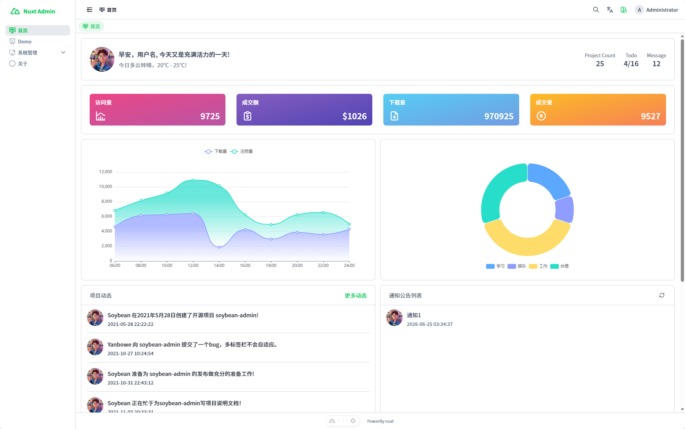
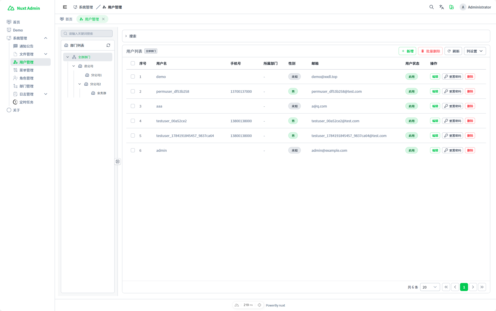
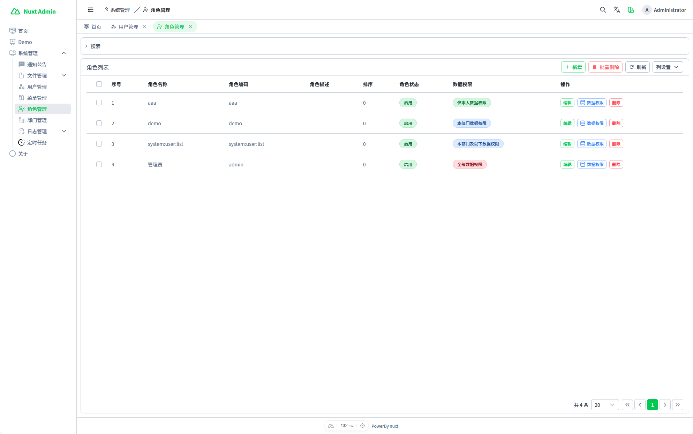
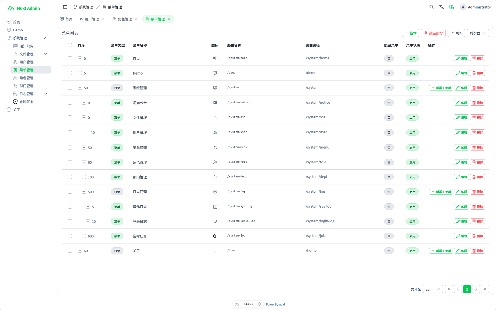

# NuxtAdmin

[English](README.md) | [简体中文](README.zh-CN.md)

NuxtAdmin 是一个基于 Nuxt 4、Nuxt UI、tRPC、Drizzle ORM 和 MySQL 构建的全栈后台管理系统。

它适合作为内部工具、业务管理平台和后台系统的基础工程。项目把后台界面、登录认证、RBAC 权限、系统模块、类型安全 API 和数据库访问放在同一个 Nuxt 应用中，方便二次开发和持续扩展。

> 推荐 Node.js 版本：`22.20.2`

## 演示

- 演示地址 1：https://nuxtadmin.devitem.top/
- 演示地址 2：https://xxdl-nuxt-admin.vercel.app/
- 账号：`admin`
- 密码：`adminadmin`

演示环境会限制具有破坏性的业务操作。编辑和删除数据会返回：`演示环境不允许操作`。

## 预览









## 功能特性

- 前端页面和服务端 API 集成在同一个 Nuxt 全栈应用中。
- 用户名密码登录和服务端会话。
- 后台页面登录态保护。
- 用户、角色、菜单、路由、数据范围和按钮权限组成的 RBAC 权限模型。
- 用户、角色、菜单、部门、字典、通知、OSS、日志和定时任务管理。
- 仪表盘页面，包含统计、图表、通知、动态和快捷入口。
- 通过 tRPC 调用类型安全 API。
- 使用 Zod 维护前后端共享 DTO 校验。
- 通过 Drizzle ORM 访问 MySQL 数据库。
- 多语言支持。
- 明暗模式和主题配置。
- 表格分页、搜索、批量操作、列设置和通用 CRUD 流程。
- 演示环境编辑/删除保护。
- 面向新业务模块的代码生成规范。

## 技术栈

- Nuxt 4
- Vue 3
- TypeScript
- Nuxt UI 4
- Tailwind CSS 4
- Pinia
- Vue Router
- tRPC / trpc-nuxt
- Zod
- Drizzle ORM
- MySQL
- nuxt-auth-utils
- nuxt-i18n-micro
- nuxt-echarts
- Vitest

## 快速开始

安装依赖：

```bash
pnpm install
```

创建并初始化数据库：

```bash
mysql -u <user> -p <database> < doc/mysql-ddl.sql
mysql -u <user> -p <database> < doc/init-self.sql
```

启动开发服务：

```bash
pnpm dev
```

启动项目前请先在 `.env` 中配置数据库和会话相关环境变量。可参考 `.env.example`。

## 常用命令

```bash
pnpm install
pnpm dev
pnpm build
pnpm preview
pnpm typecheck
pnpm test
pnpm db:push
pnpm db:pull
```

数据库初始化脚本：

```bash
mysql -u <user> -p <database> < doc/mysql-ddl.sql
mysql -u <user> -p <database> < doc/init-self.sql
```

## 代码生成

项目提供了模块生成指南：[doc/code-gen.md](doc/code-gen.md)。

当你已经创建好数据库表，并准备新增业务模块时，可以按下面的提示词让 AI 生成代码：

```text
我已建好 <table_name> 表，模块名 <module>，业务名 <BusinessName>，请根据 doc/code-gen.md 帮我生成代码。
```

示例：

```text
我已建好 demo 表，模块名 demo，业务名 Demo，请根据 doc/code-gen.md 帮我生成代码。
```

```text
我已建好 sys_user 表，模块名 system/user，业务名 SysUser，请根据 doc/code-gen.md 帮我生成代码。
```

该指南覆盖 Drizzle Schema 生成、共享 Zod DTO、Repo、Service、Router、tRPC 注册、前端页面、搜索表单、操作弹窗、i18n key 和 RBAC 权限码。

## 目录结构

下面只展示代表性文件。同类型的系统模块只保留部分目录。

```text
.
|-- app/
|   |-- components/
|   |   |-- table/
|   |   `-- u/
|   |-- composables/
|   |-- layouts/
|   |   `-- modules/
|   |-- locales/
|   |   |-- en.json
|   |   `-- zh.json
|   |-- pages/
|   |   |-- demo/
|   |   |   |-- components/
|   |   |   `-- index.vue
|   |   |-- landing/
|   |   `-- system/
|   |       |-- user/
|   |       |-- role/
|   |       |-- menu/
|   |       `-- job/
|   `-- app.vue
|-- server/
|   |-- api/
|   |-- demo-router/
|   |-- drizzle/
|   |   |-- schema/
|   |   |   |-- demo/
|   |   |   `-- system/
|   |   |-- CommonRepo.ts
|   |   `-- db.ts
|   |-- sys-router/
|   |   |-- auth/
|   |   |-- user/
|   |   |-- role/
|   |   |-- menu/
|   |   `-- job/
|   |-- tasks/
|   `-- trpc/
|       |-- middlewares/
|       |-- context.ts
|       |-- init.ts
|       `-- routers.ts
|-- shared/
|   |-- auth/
|   |-- constants/
|   |-- demo/
|   |-- system/
|   `-- types/
|-- doc/
|   |-- code-gen.md
|   |-- mysql-ddl.sql
|   `-- init-self.sql
|-- public/
|   `-- images/
|-- nuxt.config.ts
`-- package.json
```

## 定时任务

定时任务模块包含：

- `sys_job` 和 `sys_job_log` 数据库结构。
- 任务列表和任务日志后台页面。
- Cron 表达式校验。
- `Asia/Shanghai` 时区支持。
- 任务状态和运行状态字段。
- 手动立即执行。
- 通过 Nitro tasks 分发到期任务。
- 任务处理器注册。
- 执行结果和错误日志记录。
- 内置旧日志清理、演示数据重置占位处理器等示例。

## 参考项目

- [SoybeanJS](https://soybeanjs.cn/)

## 项目描述

NuxtAdmin 是一个基于 Nuxt UI、tRPC、Drizzle ORM 和 MySQL 构建的 Nuxt 4 全栈后台管理系统，包含登录认证、RBAC 权限、用户/角色/菜单/部门/字典/日志/OSS/任务管理、多语言、主题配置、演示环境保护和模块生成规范。
